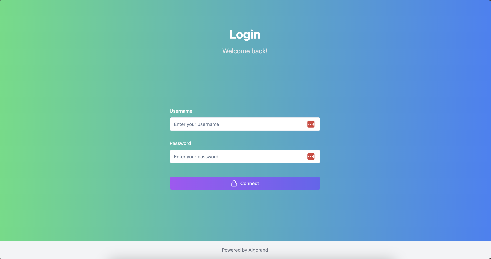
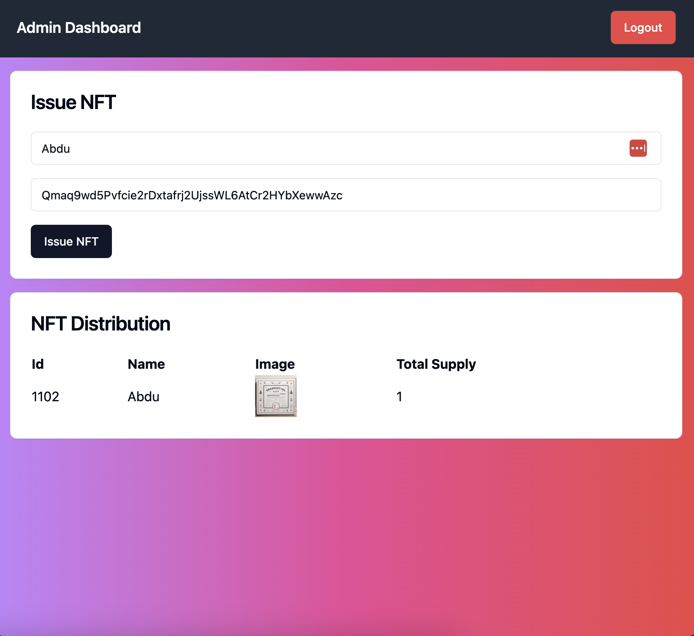
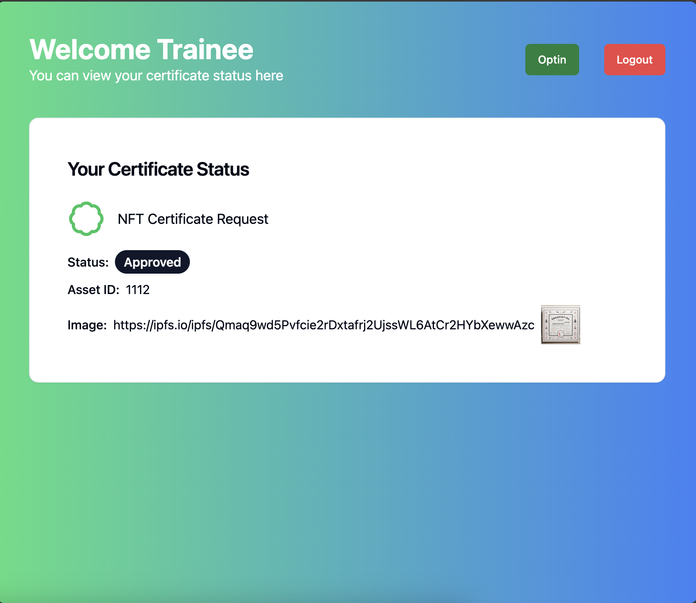

# 10 Academy NFT Certificate

## About 

This projects aims to solve the distribution of graduation certificates from 10Academy to be easily verifiable using the Algorand blockchain. The following is the user stories(roles) of the project:

- A staff role to issue and distribute NFT
- A trainee role to be able to opt-in to the NFT certificate using his/her Public Key
- A staff role to receive trainee’s opt-in request, and approve/decline the transfer of an NFT certificate to the trainee’s Public Key
- A trainee to be able to check the approval or denial of their request.

### Preview

To view more, go to the screenshots directory.

## Installation 

To run the project, you need to have the following setup

- Docker

## Usage 

To have the project up and running follow this steps

- cd to sandbox folder and ran `./sandbox up` (note this might take a while)
- cd to fastapi-backend and ran `uvicorn main:app --reload`
- cd to frontend and ran `npm run dev`

Once the project is up and running, use these creds to login as an admin and trainee respectively:

- Username: `admin`
- Password: `admin`

- Username: `trainee`
- Password: `trainee`

You can look at the `db` variable inside `main.py` in fastapi-backend folder to see how things are being stored. Replace the public_key and private_key of the admin and trainee with the output of the generated accounts. You can check how to generate them inside the `algorand_playground.ipynb` file.

To fund the generated accounts, go to the sandbox directory and first ran `./sandbox goal account list` to view accounts that have balance. Then use `./sandbox goal clerk send -a 1000000 -f public_key_from_previous_step -t public_key_generated_inside_algorand_playground_file`

## References

- [Getting Started with Algorand and Fast API](https://developer.algorand.org/solutions/python-algorand-sdk-and-fastapi/)
- [Algorand Developer Guide](https://developer.algorand.org/docs/get-started/dapps/)
- [Understand the web3 stack](https://edgeandnode.com/blog/defining-the-web3-stack)
